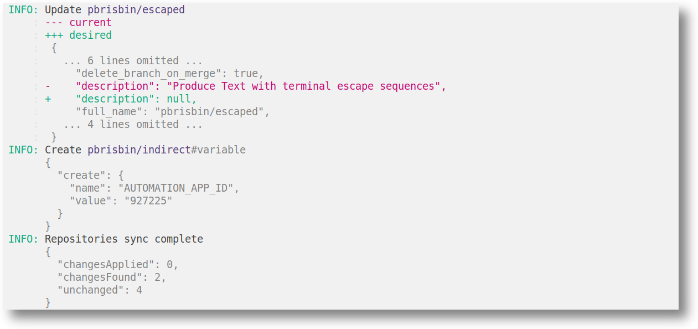

# ghctl

CLI for maintaining GitHub settings as [IaC][].

[iac]: https://en.wikipedia.org/wiki/Infrastructure_as_code



## Installation

```console
TODO
```

## Usage

```console
% ghctl --help
Usage: ghctl [-d|--dir DIRECTORY] COMMAND

  Maintain GitHub settings

Available options:
  -d,--dir DIRECTORY       Path to GHCTL directory (default: ".ghctl/")
  -h,--help                Show this help text

Available commands:
  plan                     Show differences between desired and current
  apply                    Apply changes to make current match desired
  schema                   Dump configuration schema
```

```console
% ghctl plan --help
Usage: ghctl plan [--fail-on-diff] [--fail-on-diff-exit-code NUMBER]
                  [OWNER/NAME]

  Show differences between desired and current

Available options:
  --fail-on-diff           Fail if there are un-applied differences
  --fail-on-diff-exit-code NUMBER
                           Exit code for --fail-on-diff (default: 228)
  OWNER/NAME               Limit processing to the given repositories
  -h,--help                Show this help text
```

```console
% ghctl apply --help
Usage: ghctl apply [--no-skip-delete] [OWNER/NAME]

  Apply changes to make current match desired

Available options:
  --no-skip-delete         Don't skip changes that represent deletes
  OWNER/NAME               Limit processing to the given repositories
  -h,--help                Show this help text
```

```console
% ghctl import --help
TODO
```

## `.ghctl`

The path given to `--dir` (`.ghctl` by default) should contain a `repositories`
directory and optional `defaults.yaml` file.

### Repositories

The `repositories` directory is expected to contain 2-levels of directory. Files
will be interpreted as `{owner}/{name}.yaml`, and their contents represent their
desired state to verify and/or apply.

### Defaults

If present, the `defaults.yaml` file will be loaded and applied to each
repository file before processing it. This step occurs as schema-less values,
recursively merging objects and biasing towards the repository side.

### Schema

The repository schema can be found [here][schema]. However, this schema is only
asserted **after defaults are applied**. Therefore, any given repository file
itself need not be valid schema. For example, managing a repository that follows
all defined defaults would simply be a file at the desired name and with `{}` as
its contents.

[schema]: ./repository.schema.json

Our schema follows GitHub's API exactly, so feel free to go by that
documentation as well. There is a minor difference when it comes to "keyed
lists".

For example, `rulesets` might look like:

```yaml
rulesets:
  - name: main
    # {more properties}
```

This is how the object will be encoded when interacting with the GitHub API and
is supported by our schema. However, we also support decoding the following:

```yaml
rulesets:
  main:
    # {more properties}
```

This makes it possible to supply defaults within the sub-object at the key
`main`. Otherwise, wanting to change any attribute of any rule would require
respecifying the entire `rulesets` list.

We support this decoding anywhere there is a clear uniquely-identifying
property, such as `name`, `type`, or `key`.

## Examples

I've started managing my own repositories [here](./.ghctl/).

## License

This project is licensed AGPLv3. See [COPYING](./COPYING).
